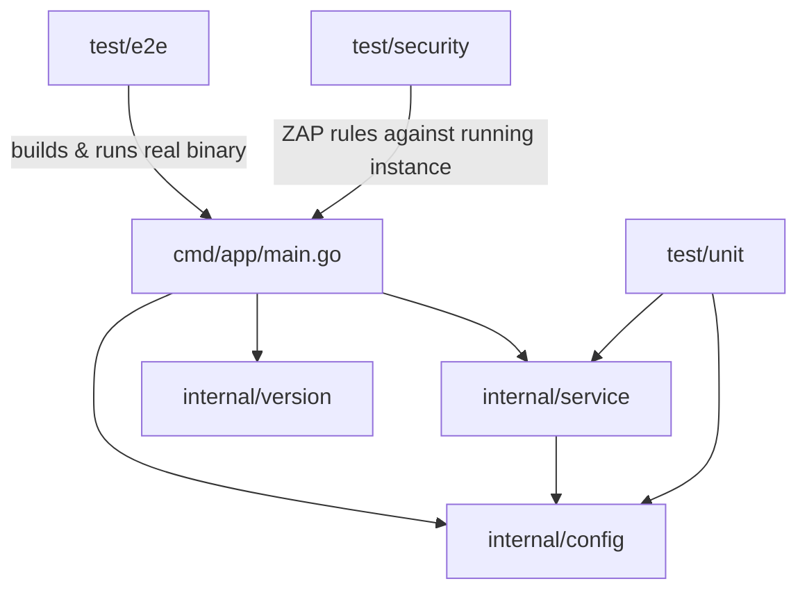
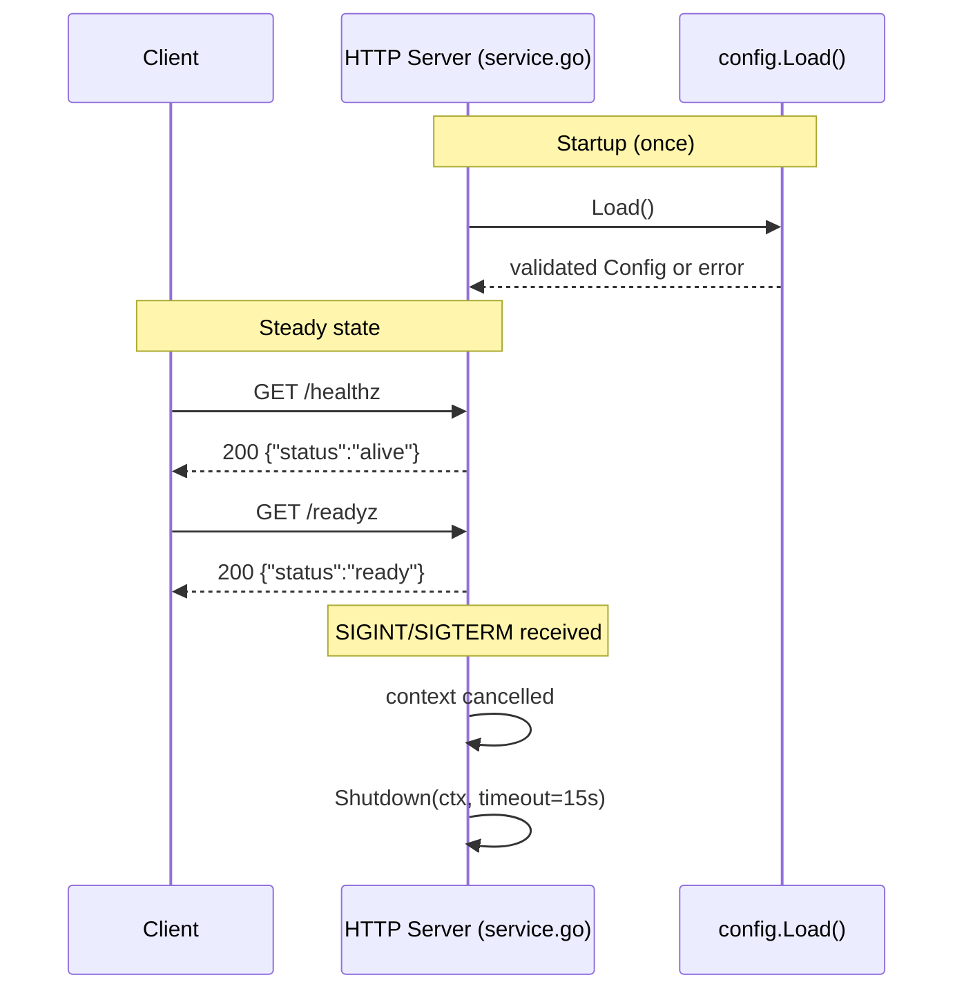
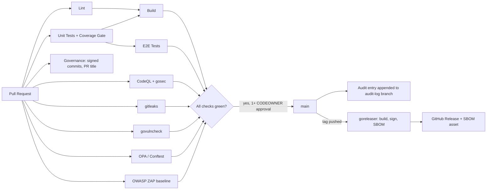
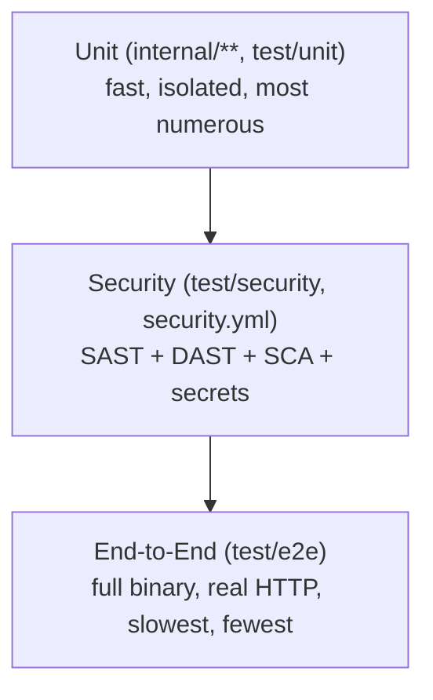

# Architecture

This document is the source of truth for system structure. If you change
package boundaries or the request lifecycle, update the diagrams below in
the same PR — reviewers should treat a stale diagram as a blocking issue,
not a nitpick.

## Package structure

## Request lifecycle

## CI/CD pipeline

## Testing pyramid

## Design decisions

- **Config precedence** (env > file > default) follows twelve-factor app
  conventions so the same binary behaves correctly across dev/staging/prod
  without code changes.
- **Distroless runtime image** (see `Dockerfile`) minimizes CVE surface —
  there's no shell or package manager to exploit post-compromise.
- **Readiness vs. liveness are separate endpoints** deliberately: a
  process can be alive but not ready (e.g., warming a cache), and
  conflating the two causes premature traffic routing during startup.
- **Security headers on every response** (`securityHeaders` middleware in
  `service.go`): CSP, HSTS, `X-Content-Type-Options`, `X-Frame-Options`,
  and `Referrer-Policy`. These are asserted by a unit test and by the
  OWASP ZAP rules (`test/security/zap-rules.tsv`), so the DAST scan and
  the code stay in agreement.
